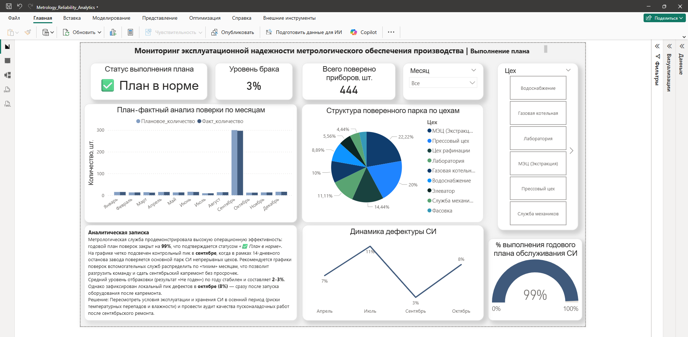
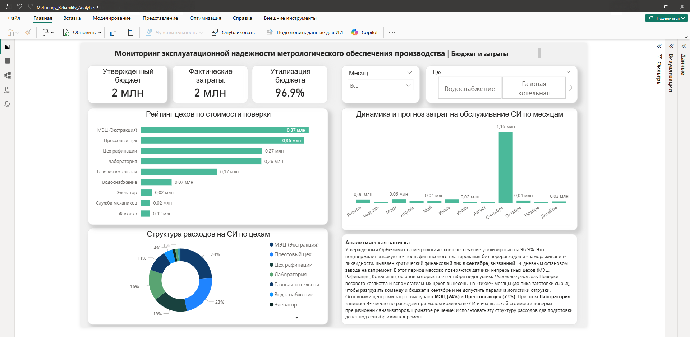
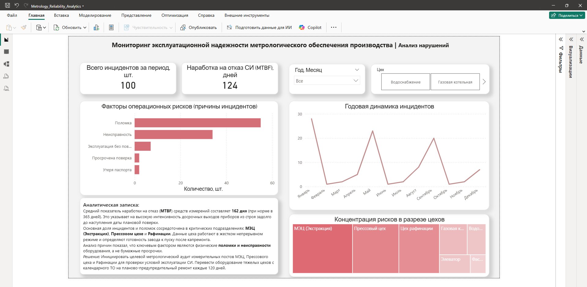

# BI-система мониторинга эксплуатационной надежности и OpEx-бюджета (МЭЗ)

Сквозное аналитическое решение в Power BI для контроля технического состояния парка измерительных приборов (СИ), анализа показателей надежности оборудования (MTBF) и оптимизации операционного бюджета (OpEx) на маслоэкстракционном заводе.

---

## 🎯 Цели и задачи проекта

* **Анализ пиковых нагрузок:** Выявление критических концентраций затрат и работ в период 14-дневного сентябрьского капремонта непрерывных цехов (МЭЦ, Рафинация, Котельная), где час простоя МЭЦ составляет $147\text{ тыс. руб.}$
* **Оценка логистических рисков:** Мониторинг состояния автомобильных и Ж/Д весов для предотвращения остановки приемки сырья и отгрузки готовой продукции.
* **Планирование OpEx-бюджета:** Выявление неравномерности расходов и предотвращение кассовых разрывов.
* **Анализ надежности (MTBF):** Оценка фактической наработки приборов на отказ для перехода к планово-предупредительному обслуживанию.

---

## 🛠 Технологический стек

* **BI-платформа:** Power BI Desktop
* **Моделирование данных:** Star Schema (Схема «Звезда»), Time Intelligence
* **Языки запросов:** DAX, Power Query (M)
* **Система контроля версий:** Git, GitHub

---

## 🏛 Архитектура данных

Модель данных построена по схеме **«Звезда» (Star Schema)**:
* **Таблицы фактов:** `Выполнение` (акты и результаты поверок), `Нарушения` (инциденты и поломки).
* **Справочники:** `Приборы`, `Цеха`, `Прайс`, `Календарь`.

Схема связей: [`dashboards/00_data_model_star_schema.png`](./dashboards/00_data_model_star_schema.png)

---

## 📐 Ключевые DAX-меры

Все рассуждения, KPI и показатели в отчете рассчитываются динамически с помощью мер на языке DAX. Полный реестр мер с комментариями доступен в файле [`dax/dax_measures.dax`](./dax/dax_measures.dax).

Примеры ключевых расчетов:

### 1. Процент исполнения плана поверок (%)
```dax
%_Исполнения_Плана = 
Процент_выполнения = 
DIVIDE(
    [Факт_количество], 
    [Плановое_количество],
    0
)

### 2. Фактические затраты на поверки (OpEx)
Факт_стоимость = 
SUMX(
    'Выполнение', 
    RELATED('Прайс'[Цена_поверки_руб.])
)

### 3. Средняя наработка на отказ (MTBF, дни)
MTBF_Прибора = 
AVERAGE('Нарушения'[Интервал_до_отказа])


## 📊 Результаты анализа и рекомендации

### 1. Выполнение плана

* **ФАКТ:** Годовой план поверок выполнен на **99%** (444 прибора). На графике четко виден контрольный пик поверок в сентябре (остановочный ремонт). В октябре зафиксирован всплеск брака до **8%** (результат «Не годен»).
* **РЕКОМЕНДАЦИЯ:** Провести аудит качества пусконаладочных работ после капремонта и пересмотреть условия хранения СИ в осенний период (риски влажности и температурных перепадов).

### 2. Бюджет и затраты (OpEx)

* **ФАКТ:** Годовой OpEx-лимит утилизирован на **96.9%** ($1.94\text{ млн руб.}$ из $2\text{ млн руб.}$). На гистограмме выявлен финансовый пик в **сентябре ($1.16\text{ млн руб.}$, $>55\%$ всего бюджета)**.
* **РЕКОМЕНДАЦИЯ:** На основе выявленного риска перенести поверки весового хозяйства и вспомогательных цехов на «тихие» месяцы (до сентябрьского ремонта и осеннего пика заготовки сырья), чтобы разгрузить команду и защитить отгрузку от паралича.

### 3. Анализ нарушений (MTBF)

* **ФАКТ:** Средняя наработка на отказ (MTBF) составляет **162 дня**. Основная доля отказов приходится на МЭЦ, Прессовый цех и Рафинацию. Ключевая причина — физические поломки оборудования в процессе эксплуатации.
* **РЕКОМЕНДАЦИЯ:** Инициировать метрологический аудит измерительных постов тяжелых цехов и перевести их оборудование с календарного ТО на планово-предупредительный ремонт каждые 120 дней.

---

## 🚀 Быстрый запуск

1. Склонируйте репозиторий:
   ```bash
   git clone [https://github.com/mgubina/metrology-reliability-powerbi-analytics.git](https://github.com/mgubina/metrology-reliability-powerbi-analytics.git)

2.  Откройте файл отчета model/Metrology_Reliability_Analytics.pbix в Power BI Desktop.
3. Все данные импортированы в модель, дополнительная настройка источников не требуется.
